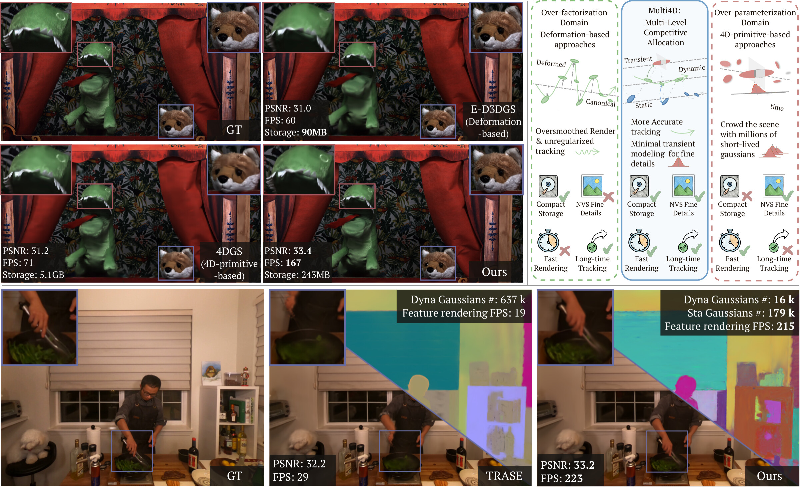
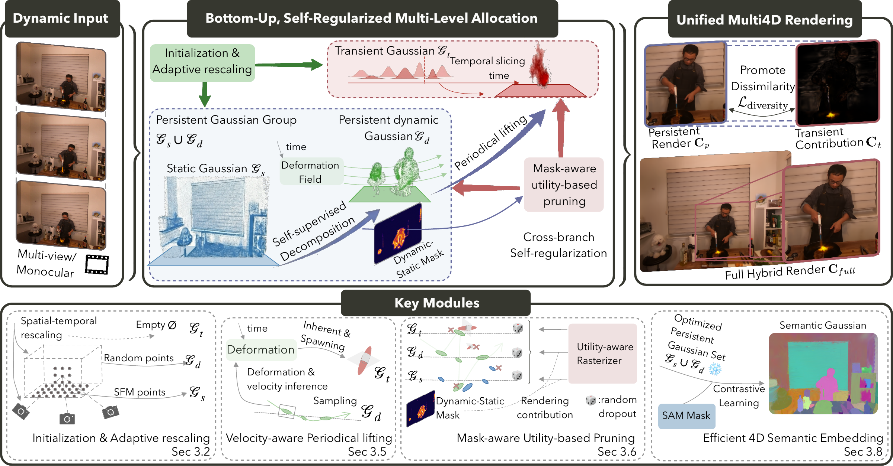

<div align="center">

# Multi4D: High-Fidelity Dynamic Gaussian Splatting via Multi-Level Competitive Allocation

### ECCV 2026

[Rui Wang](https://pdz.ethz.ch/the-group/people/rui-wang.html) · [Quentin Lohmeyer](https://pdz.ethz.ch/the-group/people/lohmeyer.html) · [Siyu Tang](https://vlg.inf.ethz.ch/team/Prof-Dr-Siyu-Tang.html) · [Mirko Meboldt](https://pdz.ethz.ch/the-group/people/meboldt.html)

**ETH Zürich**

[](https://batfacewayne.github.io/Multi4D.io/)
[](https://youtu.be/C-VxfkfFk-g)
[](https://arxiv.org/abs/2606.22197)



</div>

> **Multi4D** enables (1) high-quality, efficient dynamic scene reconstruction via competitive multi-level specialization, and (2) compact, high-accuracy 4D segmentation with fast inference.

---

## 🚧 Code Coming Soon

The official implementation of **Multi4D**(coming soon)

---

## Abstract

Dynamic 3D Gaussian splatting faces a fundamental tension between motion consistency and visual fidelity. Deformation-based approaches preserve temporal correspondence but suffer from motion over-factorization, oversmoothing high-frequency dynamics. In contrast, 4D-primitive methods capture fine visual details yet incur temporal over-parameterization, breaking object identity and leading to severe storage overhead. To resolve this, we introduce **Multi4D**, a framework for high-fidelity dynamic Gaussian Splatting based on multi-level competitive allocation. Instead of a monolithic representation, we distribute modeling capacity across three structured levels: static structure, persistent dynamic geometry, and transient appearance primitives. Through shared rasterization and residual-driven optimization, these levels dynamically compete to explain photometric error, enabling adaptive specialization without pre-assigned decomposition. This allocation preserves long-term motion consistency while capturing fine dynamic detail, achieving state-of-the-art rendering quality and real-time performance with significantly fewer dynamic primitives. Furthermore, because our representation explicitly tracks compact persistent Gaussians over time, semantic features can be embedded afterward, enabling Multi4D to achieve state-of-the-art 4D segmentation accuracy with an order-of-magnitude speedup.

## Pipeline

<p align="center"></p>

Multi4D decomposes a dynamic scene into three functionally specialized Gaussian subsets that compete under a shared photometric objective: **Static** Gaussians anchor the time-invariant structure; **Persistent Dynamic** Gaussians model long-term, trackable motion through a geometry-only deformation field; and **Transient** Gaussians (4D primitives) absorb high-frequency appearance residuals. All subsets are rendered in a single differentiable pass — shared transmittance couples their gradients and induces competition, so once one subset explains a region, residual-driven densification in the others is suppressed. A bottom-up training strategy with *velocity-aware periodical lifting* and *mask-aware utility-based pruning* yields compact, specialized representations, and the persistent subset can be frozen for fast, accurate 4D semantic embedding.

## Links

- 🌐 **Project page:** https://batfacewayne.github.io/Multi4D.io/
- ▶ **Overview video:** https://youtu.be/C-VxfkfFk-g
- 📄 **Paper (arXiv):** https://arxiv.org/abs/2606.22197

## Citation

If you find Multi4D useful, please consider citing:

```bibtex
@misc{wang2026multi4d,
  title={Multi4D: High-Fidelity Dynamic Gaussian Splatting via Multi-Level Competitive Allocation},
  author={Rui Wang and Quentin Lohmeyer and Siyu Tang and Mirko Meboldt},
  year={2026},
  eprint={2606.22197},
  archivePrefix={arXiv},
  primaryClass={cs.CV},
  url={https://arxiv.org/abs/2606.22197}
}
```

## License

This project is released under the [GNU GPL-3.0](LICENSE) license.
