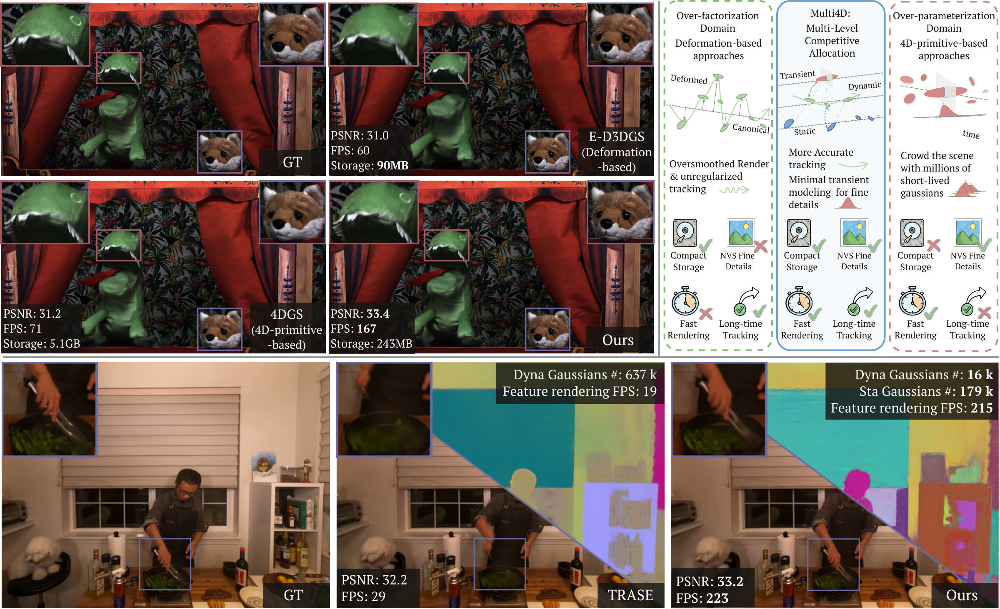
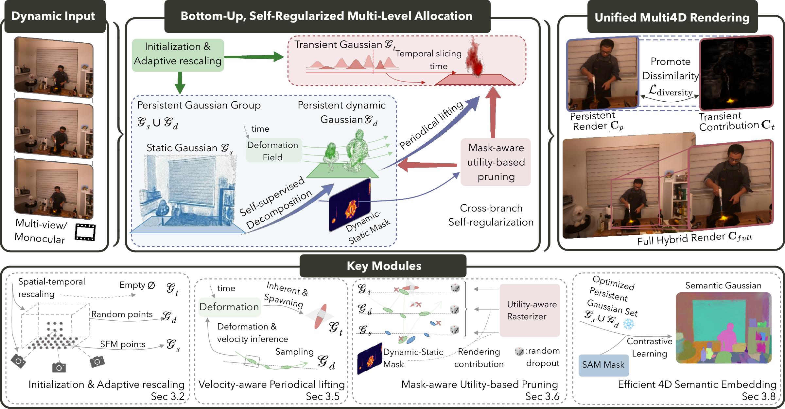

<div align="center">

# Multi4D: High-Fidelity Dynamic Gaussian Splatting via Multi-Level Competitive Allocation

### ECCV 2026

[Rui Wang](https://batfacewayne.github.io/ruiwang/) · [Quentin Lohmeyer](https://pdz.ethz.ch/the-group/people/lohmeyer.html) · [Siyu Tang](https://vlg.inf.ethz.ch/team/Prof-Dr-Siyu-Tang.html) · [Mirko Meboldt](https://pdz.ethz.ch/the-group/people/meboldt.html)

**ETH Zürich**

[](https://batfacewayne.github.io/Multi4D.io/)
[](https://youtu.be/C-VxfkfFk-g)
[](https://arxiv.org/abs/2606.22197)



</div>

> **Multi4D** enables (1) high-quality, efficient dynamic scene reconstruction via competitive multi-level specialization, and (2) compact, high-accuracy 4D segmentation with fast inference.

---

## News

2026.8.3: Initial Code Release

---

## Abstract

Dynamic 3D Gaussian splatting faces a fundamental tension between motion consistency and visual fidelity. Deformation-based approaches preserve temporal correspondence but suffer from motion over-factorization, oversmoothing high-frequency dynamics. In contrast, 4D-primitive methods capture fine visual details yet incur temporal over-parameterization, breaking object identity and leading to severe storage overhead. To resolve this, we introduce **Multi4D**, a framework for high-fidelity dynamic Gaussian Splatting based on multi-level competitive allocation. Instead of a monolithic representation, we distribute modeling capacity across three structured levels: static structure, persistent dynamic geometry, and transient appearance primitives. Through shared rasterization and residual-driven optimization, these levels dynamically compete to explain photometric error, enabling adaptive specialization without pre-assigned decomposition. This allocation preserves long-term motion consistency while capturing fine dynamic detail, achieving state-of-the-art rendering quality and real-time performance with significantly fewer dynamic primitives. Furthermore, because our representation explicitly tracks compact persistent Gaussians over time, semantic features can be embedded afterward, enabling Multi4D to achieve state-of-the-art 4D segmentation accuracy with an order-of-magnitude speedup.

## Pipeline

<p align="center"></p>

Multi4D decomposes a dynamic scene into three functionally specialized Gaussian subsets that compete under a shared photometric objective: **Static** Gaussians anchor the time-invariant structure; **Persistent Dynamic** Gaussians model long-term, trackable motion through a geometry-only deformation field; and **Transient** Gaussians (4D primitives) absorb high-frequency appearance residuals. All subsets are rendered in a single differentiable pass — shared transmittance couples their gradients and induces competition, so once one subset explains a region, residual-driven densification in the others is suppressed. A bottom-up training strategy with *velocity-aware periodical lifting* and *mask-aware utility-based pruning* yields compact, specialized representations, and the persistent subset can be frozen for fast, accurate 4D semantic embedding.

---

## Setup

Needs a CUDA GPU and `nvcc`; the extensions are compiled, not shipped as wheels.

```bash
conda create -n multi4d python=3.11 && conda activate multi4d
# a plain venv works too:  python3.11 -m venv multi4d && . multi4d/bin/activate

# mmcv 1.6.0 has a legacy setup.py that imports pkg_resources, which setuptools
# 66+ removed. Pin it BEFORE anything else.
pip install "setuptools<66" wheel

# torch build matching your CUDA -- install it before requirements.txt, because
# the CUDA extensions below import torch at build time. Example for CUDA 12.1:
pip install torch torchvision --index-url https://download.pytorch.org/whl/cu121

# --no-build-isolation is required throughout: an isolated build environment
# would not see the pinned setuptools, nor torch.
pip install --no-build-isolation -r requirements.txt

# CUDA rasterizer + kNN. Install these NON-editable: simple-knn's setup.py
# declares only ext_modules and no packages, so `pip install -e` maps nothing --
# pip reports success and the import still fails.
pip install --no-build-isolation submodules/diff-gaussian-rasterization
pip install --no-build-isolation submodules/simple-knn
```

Two things to expect: `numpy<2` is pinned in `requirements.txt` because mmcv 1.6.0
is built against the numpy 1.x ABI, and the hybrid rasterizer is JIT-compiled on
first import, so the first run takes a few extra minutes on a GPU.

Verified from scratch on Python 3.11.6, torch 2.5.1+cu121, numpy 1.26.4,
mmcv 1.6.0, CUDA 12.1. The optional 4D-segmentation stage needs extra packages,
installed in its own section below.

## Data

### Neu3D (dynerf)

Prepared the [DeGauss](https://github.com/BatFaceWayne/DeGauss) way — follow their Neu3D
instructions, which produce the layout below. Train with `-s <scene>`.

```
<scene>/
├── poses_bounds.npy      LLFF poses, one row per camera
├── fused.ply             dense COLMAP cloud from frame 0 -- inits the static branch
├── cam00.mp4 … camNN.mp4 one video per camera
└── cam00/images/         frames, auto-extracted from the videos on first run
```

### Technicolor

1. Run the [SpacetimeGaussians](https://github.com/oppo-us-research/SpacetimeGaussians)
   Technicolor preprocessing. It produces one COLMAP reconstruction per timestep,
   `colmap_0 … colmap_49`, which is the layout and protocol this reader expects.
2. **Build `fused.ply` the same way as Neu3D above** — dense COLMAP on the first
   frame across all cameras — and place it in **`colmap_0/`**. Only the first
   timestep needs one.
3. Train with `-s <scene>/colmap_0` — the first-timestep directory, **not** the
   scene root.

```
<scene>/
├── colmap_0/
│   ├── sparse/0/{cameras,images}.bin   (.txt also accepted)
│   ├── images/                         all cameras, timestep 0
│   └── fused.ply                       dense, frame 0; first timestep ONLY
├── colmap_1/images/
└── …  colmap_49/images/
```

### NeRF-DS / HyperNeRF (nerfies format)

1. Unpack the scenes released by [NeRF-DS](https://github.com/JokerYan/NeRF-DS) —
   no preprocessing, and no COLMAP step: the static branch is initialised from the
   `points.npy` that ships with the data.
2. Train with `-s <path>/<scene>_novel_view`.

```
<scene>_novel_view/
├── dataset.json     ids / train_ids / val_ids
├── metadata.json    per-id time_id
├── points.npy       point cloud, initialises the static branch
├── camera/<id>.json one per image
└── rgb/1x/<id>.png  images, always read at full resolution
```

## Training

##### please refer to the configs in folder `arguments` for different dataset setup

For a Neu3D scene such as `cut_roasted_beef`, run

```bash
python train.py -s data/dynerf/cut_roasted_beef --port 6019 --expname cut_roasted_beef --configs arguments/dynerf.py --model_path output/cut_roasted_beef
```

For the two wild/sky Neu3D scenes (`coffee_martini`, `flame_salmon`), run

```bash
python train.py -s data/dynerf/coffee_martini --port 6019 --expname coffee_martini --configs arguments/dynerf_w.py --model_path output/coffee_martini
```

For a Technicolor scene such as `Painter`, point `-s` at the first timestep, run

```bash
python train.py -s data/technicolor/Painter/colmap_0 --port 6019 --expname Painter --configs arguments/dynerf.py --model_path output/Painter
```

For a NeRF-DS scene such as `sieve`, run

```bash
python train.py -s data/nerf-ds/sieve_novel_view --port 6019 --expname sieve --configs arguments/nerfds.py --model_path output/sieve
```

`as` is the one NeRF-DS scene with its own config — use `arguments/nerfds_as.py`.

| Config | Use for |
|---|---|
| `arguments/dynerf.py` | Neu3D `cut_roasted_beef, flame_steak, sear_steak, cook_spinach`; all Technicolor scenes |
| `arguments/dynerf_w.py` | Neu3D wild/sky scenes: `coffee_martini, flame_salmon` |
| `arguments/nerfds.py` | NeRF-DS `basin, bell, cup, plate, press, sieve` |
| `arguments/nerfds_as.py` | NeRF-DS `as` |

Outputs: the best-PSNR checkpoint is kept in `<model_path>/point_cloud/best/`
(overwritten as it improves; `best/per_frame_metrics.json` records which iteration it
came from), alongside the final `iteration_<N>/`. Renders and `debug_metrics.json` go
to `--saving_folder`, which defaults to `./results/`.

## 4D Segmentation

<details>
<summary><b>Click to expand — optional stage, not needed for reconstruction</b></summary>
<br>

After reconstruction the persistent subset is frozen and semantic features are
distilled onto it, then queried by text.

#### Install

Only needed for this stage — reconstruction does not use any of it.

```bash
pip install -r requirements-semantic.txt

# pytorch3d (KNN) has no PyPI release and FAIR's prebuilt wheel index is no
# longer public, so it has to be built from source. This compiles CUDA kernels
# and takes ~30 min; run it on a machine with nvcc and a GPU.
pip install fvcore iopath
FORCE_CUDA=1 pip install --no-build-isolation \
    "git+https://github.com/facebookresearch/pytorch3d.git@stable"

# SAM weights (2.4 GB) -- GroundingDINO downloads itself from HuggingFace
mkdir -p dependency && wget -P dependency \
    https://dl.fbaipublicfiles.com/segment_anything/sam_vit_h_4b8939.pth
```

#### Data

Supervision is the per-image SAM masks from [TRASE](https://github.com/yunjinli/TRASE);
ground truth for scoring is their
[Mask-Benchmark](https://huggingface.co/datasets/yunjinli/Mask-Benchmark).

```
<trase_root>/<scene>/masks/cam01_0000.pt         supervision, one per (camera, frame)
<benchmark>/Neu3D-Mask/<scene>/gt_masks/*.png    ground truth for scoring
```

Masks are also read from `<scene>/cam01/masks/0000.pt` if `--trase_root` has no
entry. A missing mask does not fail the run — it prints `Mask not found` and skips
the loss for that view, so grep for it before trusting a run.

#### Run

Assumes a scene already trained with `train.py`:

```bash
SCENE=data/dynerf/sear_steak            # -s used for reconstruction
CKPT=output/sear_steak                  # --model_path used for reconstruction
RUN=sear_steak_sem                      # name for this segmentation run
```

1. Distil semantic features onto the frozen Gaussians (~3 h):

```bash
python train_semantic.py -s $SCENE --expname $RUN \
    --configs arguments/dynerf.py --start_checkpoint $CKPT \
    --trase_root data/TRASE/neu3d --saving_folder results/
```

2. Cluster them and pick the cluster a text prompt names:

```bash
### optional occlusion-aware flag  --occlusion_aware
python render_cluster_by_text.py -s $SCENE --expname $RUN \
    --configs arguments/dynerf.py --render_checkpoint $CKPT \
    --saving_folder results/ --text_prompt "Person"
```

3. Score the predicted masks:

```bash
python eval_seg.py results/$RUN/ours_-1_text/pred_masks \
    data/Mask-Benchmark/Neu3D-Mask/sear_steak/gt_masks
```

`cluster_semantic_features.py` and `render_semantic_features.py` are optional
inspection tools over the same checkpoints.

</details>

## Repository layout

```
train.py                  reconstruction training loop (evaluates as it trains)
train_semantic.py         4D semantic feature distillation
render_cluster_by_text.py text-prompted cluster selection -> predicted masks
eval_seg.py               mIoU / mAcc for 4D segmentation
cluster_semantic_features.py, render_semantic_features.py
                          optional inspection tools for the semantic stage
arguments/                __init__.py (all defaults) + the 4 dataset configs
scene/                    Gaussian branches, deformation field, HexPlane, data loaders
gaussian_renderer/        the unified rasterization pass
utils/                    losses, evaluation (PSNR/SSIM/LPIPS), geometry helpers
submodules/               CUDA rasterizer + kNN (pip-installed)
diff_gaussian_rasterization_hybrid/
                          hybrid rasterizer, JIT-compiled on first import
ext/                      GroundedSAM helper for the segmentation stage
```

## Acknowledgements

We thank the authors of the following works for releasing their code, which this
project builds on:

- [DeGauss: Dynamic-Static Decomposition with Gaussian Splatting for Distractor-free 3D Reconstruction](https://github.com/BatFaceWayne/DeGauss)
- [TRASE: Tracking-free 4D Segmentation and Editing](https://github.com/yunjinli/TRASE)
- [Hybrid 3D-4D Gaussian Splatting for Fast Dynamic Scene Representation](https://github.com/ohsngjun/3D-4DGS)

## Citation

If you find Multi4D useful, please consider citing:

```bibtex
@misc{wang2026multi4d,
  title={Multi4D: High-Fidelity Dynamic Gaussian Splatting via Multi-Level Competitive Allocation},
  author={Rui Wang and Quentin Lohmeyer and Siyu Tang and Mirko Meboldt},
  year={2026},
  eprint={2606.22197},
  archivePrefix={arXiv},
  primaryClass={cs.CV},
  url={https://arxiv.org/abs/2606.22197}
}
```

## License

This project is released under the [GNU GPL-3.0](LICENSE) license.
